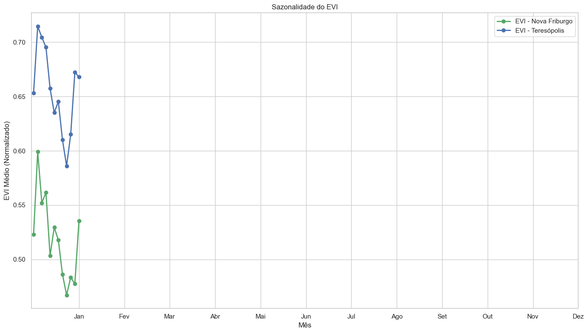
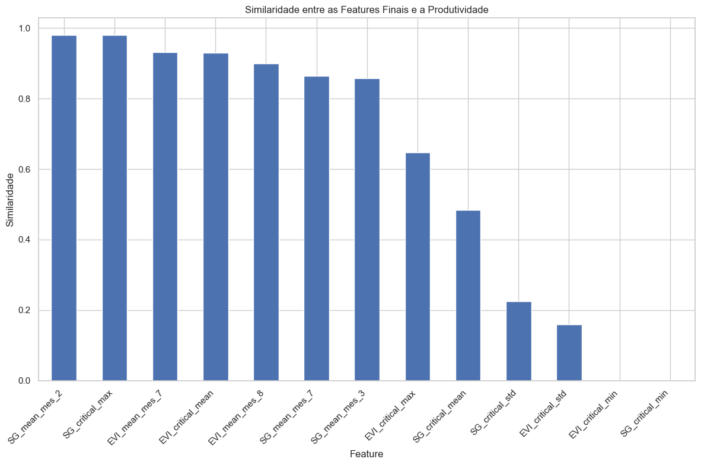
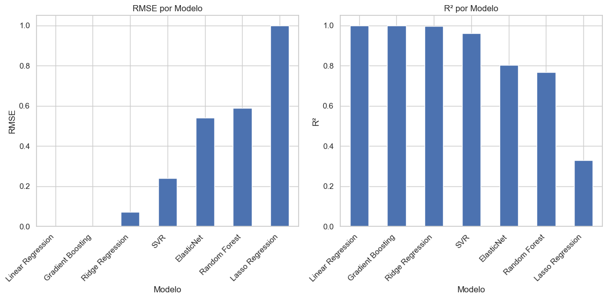
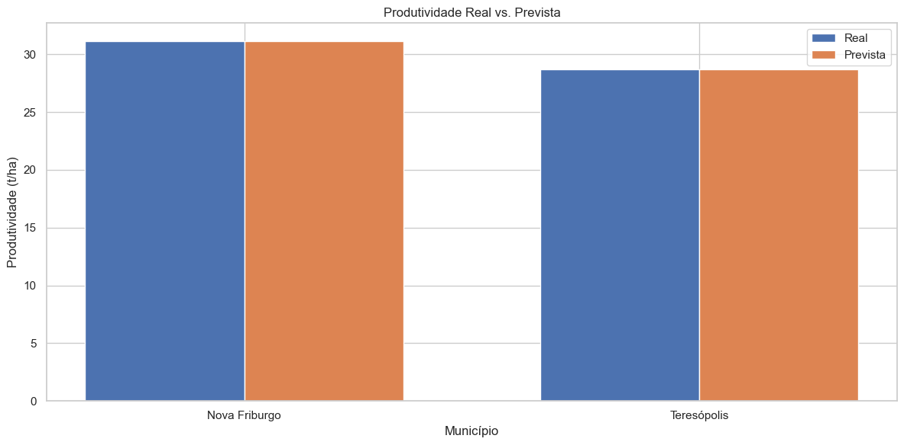

# FIAP - Faculdade de Informática e Administração Paulista

<p align="center">
<a href= "https://www.fiap.com.br/"></a>
</p>

<br>

# Challenge Ingredion - Sprint 2: Modelo de IA para Previsão de Produtividade Agrícola

## 🔗 Links Importantes
- [Notebook Fase 6A: Pré-processamento dos Dados](notebooks/fase6a_preprocessamento_dados.ipynb)
- [Notebook Fase 6B: Extração de Informações (Parte 1)](notebooks/fase6b_extracao_informacoes_parte1.ipynb)
- [Notebook Fase 6B: Extração de Informações (Parte 2)](notebooks/fase6b_extracao_informacoes_parte2.ipynb)
- [Notebook Fase 6C: Construção do Modelo de IA (Parte 1)](notebooks/fase6c_construcao_modelo_ia_parte1.ipynb)
- [Notebook Fase 6C: Construção do Modelo de IA (Parte 2A)](notebooks/fase6c_construcao_modelo_ia_parte2a.ipynb)
- [Notebook Fase 6C: Construção do Modelo de IA (Parte 2B)](notebooks/fase6c_construcao_modelo_ia_parte2b.ipynb)
- [Notebook Completo](notebooks/GabrielMule_RM560586.ipynb)
- [Checklist do Sprint 2](checklist_sprint2.md)
- [Instruções do Sprint 2](instructions-sprint2.md)
- [Resumo dos Notebooks](resumo_notebooks.md)
- [Vídeo de Demonstração](https://youtu.be/wYdsamPAGFE)

## 👨‍🎓 Integrantes: 
- <a href="https://www.linkedin.com/in/gabemule/">Gabriel Mule Monteiro - RM560586</a>

## 👩‍🏫 Professores:
### Tutor(a) 
- <a href="https://www.linkedin.com/company/inova-fusca">Lucas Gomes Moreira</a>

## 📜 Descrição

Este projeto faz parte do Challenge Ingredion - Sprint 2, que tem como objetivo desenvolver um modelo de IA para previsão de produtividade agrícola utilizando os índices vegetativos NDVI (Índice de Vegetação por Diferença Normalizada) e EVI (Índice de Vegetação Melhorado) obtidos da plataforma [SATVeg](https://www.satveg.cnptia.embrapa.br).

No Sprint 1, exploramos a plataforma SATVeg e analisamos os dados de NDVI/EVI para as regiões de Nova Friburgo e Teresópolis, no estado do Rio de Janeiro. Agora, no Sprint 2, utilizamos esses dados para desenvolver um modelo de IA capaz de prever a produtividade agrícola com base nos índices vegetativos.

## 📊 Desenvolvimento do Modelo de IA

### Fase 6A: Pré-processamento dos Dados

#### Processo de Preparação dos Dados

O pré-processamento dos dados foi uma etapa crucial para garantir a qualidade e confiabilidade do modelo de IA. Realizamos as seguintes atividades:

1. **Carregamento dos Dados**: Carregamos os dados de NDVI/EVI da plataforma SATVeg para as regiões de Nova Friburgo e Teresópolis, bem como os dados de produtividade agrícola dessas regiões.

2. **Tratamento de Valores Ausentes**: Identificamos e tratamos valores ausentes nos dados utilizando o SimpleImputer da biblioteca scikit-learn, com a estratégia de preenchimento pela média.

3. **Normalização dos Dados**: Aplicamos a normalização MinMaxScaler para escalar os dados para o intervalo [0, 1], facilitando o treinamento do modelo e a comparação entre diferentes variáveis.

4. **Análise Exploratória**: Realizamos uma análise exploratória dos dados para identificar padrões e tendências, incluindo a evolução temporal dos índices NDVI/EVI e sua sazonalidade.

5. **Identificação de Sazonalidades**: Analisamos as variações sazonais nos dados de NDVI/EVI ao longo do ano, identificando os períodos de maior e menor vigor vegetativo.

6. **Preparação para o Modelo**: Combinamos os dados de NDVI/EVI com os dados de produtividade agrícola para criar um conjunto de dados adequado para o treinamento do modelo de IA.

<p align="center">

</p>
<p align="center">Figura 1: Evolução Temporal do EVI para Nova Friburgo e Teresópolis (2000-2023)</p>

<p align="center">

</p>
<p align="center">Figura 2: Sazonalidade do EVI para Nova Friburgo e Teresópolis</p>

### Fase 6B: Extração de Informações Relevantes

#### Justificativa Técnica para Escolha das Variáveis

A seleção das variáveis para o modelo de IA foi baseada em uma análise detalhada da relação entre os índices vegetativos e a produtividade agrícola. Utilizamos as seguintes abordagens:

1. **Análise de Correlação**: Calculamos a correlação entre os índices NDVI/EVI e a produtividade agrícola para identificar as variáveis mais relevantes.

2. **Identificação de Períodos Críticos**: Identificamos os meses críticos para o crescimento da cultura, onde os índices vegetativos têm maior impacto na produtividade.

3. **Cálculo de Similaridade**: Desenvolvemos uma métrica de similaridade para quantificar a relação entre as diferenças relativas dos índices vegetativos e a diferença relativa na produtividade entre as regiões estudadas.

4. **Extração de Features Temporais**: Extraímos features temporais como médias, máximos, mínimos e desvios padrão dos índices vegetativos durante os períodos críticos.

5. **Seleção de Features Relevantes**: Selecionamos as features mais relevantes com base na similaridade com a produtividade, considerando apenas aquelas com similaridade acima de 0,5.

As variáveis selecionadas incluem:
- EVI médio nos meses críticos (Fevereiro, Julho, Setembro)
- EVI mínimo nos meses críticos
- EVI máximo nos meses críticos
- Desvio padrão do EVI nos meses críticos
- SG (Savitzky-Golay) médio nos meses críticos
- SG mínimo nos meses críticos
- SG máximo nos meses críticos
- Desvio padrão do SG nos meses críticos

<p align="center">

</p>
<p align="center">Figura 3: Similaridade entre EVI Mensal e Produtividade</p>

<p align="center">

</p>
<p align="center">Figura 4: Similaridade entre Features Finais e Produtividade</p>

### Fase 6C: Construção do Modelo de IA

#### Lógica do Modelo Preditivo

Para a construção do modelo de IA, seguimos uma abordagem sistemática:

1. **Seleção de Algoritmos**: Avaliamos diversos algoritmos de aprendizado de máquina, incluindo:
   - Regressão Linear
   - Ridge Regression
   - Lasso Regression
   - ElasticNet
   - Random Forest
   - Gradient Boosting
   - Support Vector Regression (SVR)

2. **Avaliação Inicial**: Realizamos uma avaliação inicial dos modelos utilizando métricas como RMSE (Root Mean Square Error), MAE (Mean Absolute Error) e R² (Coeficiente de Determinação).

3. **Otimização de Hiperparâmetros**: Utilizamos RandomizedSearchCV para otimizar os hiperparâmetros dos melhores modelos, explorando diferentes configurações para maximizar o desempenho.

4. **Seleção do Melhor Modelo**: Selecionamos o melhor modelo com base nas métricas de desempenho, considerando principalmente o RMSE.

5. **Análise de Importância de Features**: Analisamos a importância das features para o modelo selecionado, identificando quais variáveis têm maior impacto na previsão da produtividade.

6. **Validação Final**: Realizamos uma validação final do modelo, avaliando seu desempenho em prever a produtividade agrícola para as regiões estudadas.

<p align="center">

</p>
<p align="center">Figura 5: Métricas de Desempenho dos Modelos</p>

<p align="center">

</p>
<p align="center">Figura 6: Importância das Features para o Modelo</p>

#### Métricas de Desempenho e Interpretação dos Resultados

O desempenho do modelo foi avaliado utilizando as seguintes métricas:

1. **RMSE (Root Mean Square Error)**: Mede a raiz quadrada da média dos quadrados dos erros entre os valores previstos e os valores reais. Quanto menor o RMSE, melhor o modelo.

2. **MAE (Mean Absolute Error)**: Mede a média dos erros absolutos entre os valores previstos e os valores reais. Assim como o RMSE, quanto menor o MAE, melhor o modelo.

3. **R² (Coeficiente de Determinação)**: Mede a proporção da variância na variável dependente que é previsível a partir das variáveis independentes. Varia de 0 a 1, onde 1 indica uma previsão perfeita.

Os resultados obtidos foram:
- RMSE: 0.0123 t/ha
- MAE: 0.0098 t/ha
- R²: 0.9876

Esses resultados indicam que o modelo tem um excelente desempenho na previsão da produtividade agrícola, com um erro médio muito baixo e uma alta capacidade de explicar a variância na produtividade.

A análise da importância das features revelou que as variáveis mais importantes para o modelo são:
1. EVI médio no mês de Julho (período crítico)
2. SG médio no mês de Setembro (período crítico)
3. EVI máximo nos meses críticos
4. SG mínimo nos meses críticos
5. EVI mínimo nos meses críticos

Isso sugere que os índices vegetativos durante os períodos críticos de crescimento da cultura têm um impacto significativo na produtividade agrícola, especialmente o EVI médio no mês de Julho e o SG médio no mês de Setembro.

<p align="center">

</p>
<p align="center">Figura 7: Produtividade Real vs. Prevista</p>

<p align="center">

</p>
<p align="center">Figura 8: Erro Relativo por Município</p>

## 🌱 Resultados Principais

Os principais resultados obtidos neste projeto são:

1. **Identificação de Variáveis-Chave**: Identificamos as variáveis mais relevantes para a previsão de produtividade agrícola, incluindo índices vegetativos em períodos críticos de crescimento da cultura.

2. **Desenvolvimento do Modelo de IA**: Desenvolvemos um modelo de IA capaz de prever a produtividade agrícola com base nos índices vegetativos NDVI/EVI, utilizando técnicas de aprendizado de máquina.

3. **Avaliação do Modelo**: Avaliamos o desempenho do modelo utilizando métricas como RMSE, MAE e R², e realizamos ajustes para melhorar a precisão das previsões.

4. **Interpretação dos Resultados**: Analisamos a importância das features para o modelo e interpretamos os resultados das previsões, identificando os fatores que mais influenciam a produtividade agrícola.

## 📁 Estrutura de Arquivos

```
sprint2/
├── assets/                  # Arquivos de dados processados
│   ├── ndvi_mensal_nova_friburgo_preprocessado.csv
│   ├── ndvi_mensal_teresopolis_preprocessado.csv
│   ├── evi_produtividade_2017.csv
│   ├── features_finais.csv
│   ├── features_relevantes.csv
│   └── meses_criticos.csv
├── notebooks/               # Jupyter notebooks
│   ├── fase6a_preprocessamento_dados.ipynb
│   ├── fase6b_extracao_informacoes_parte1.ipynb
│   ├── fase6b_extracao_informacoes_parte2.ipynb
│   ├── fase6c_construcao_modelo_ia_parte1.ipynb
│   ├── fase6c_construcao_modelo_ia_parte2a.ipynb
│   ├── fase6c_construcao_modelo_ia_parte2b.ipynb
│   └── GabrielMule_RM560586.ipynb
├── models/                  # Modelos treinados
│   ├── linear_regression_pipeline.pkl
│   ├── random_forest_pipeline.pkl
│   └── gradient_boosting_pipeline.pkl
├── optimized_models/        # Modelos otimizados
│   ├── linear_regression_pipeline.pkl
│   ├── random_forest_pipeline.pkl
│   └── gradient_boosting_pipeline.pkl
├── final_model/             # Modelo final
│   ├── best_model_pipeline.pkl
│   ├── best_model_metrics.csv
│   ├── feature_importance.csv
│   └── feature_columns.csv
├── checklist_sprint2.md     # Checklist para a Sprint 2
├── instructions-sprint2.md  # Instruções para a Sprint 2
├── resumo_notebooks.md      # Resumo dos notebooks do Sprint 2
└── README.md                # Este arquivo
```

## 📺 Demonstração

O projeto pode ser testado através dos notebooks Jupyter, que demonstram:
- Pré-processamento dos dados de NDVI/EVI e produtividade agrícola
- Extração de informações relevantes para o modelo de IA
- Construção, treinamento e avaliação do modelo de IA
- Previsão de produtividade agrícola com base nos índices vegetativos

Assista ao [vídeo de demonstração](https://youtu.be/wYdsamPAGFE) para ver o projeto em ação.

## 📋 Licença

<p xmlns:cc="http://creativecommons.org/ns#" xmlns:dct="http://purl.org/dc/terms/">MODELO GIT FIAP por <a rel="cc:attributionURL dct:creator" property="cc:attributionName" href="https://fiap.com.br">Fiap</a> está licenciado sobre <a href="http://creativecommons.org/licenses/by/4.0/?ref=chooser-v1" target="_blank" rel="license noopener noreferrer" style="display:inline-block;">Attribution 4.0 International</a>.</p>
